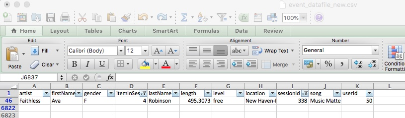
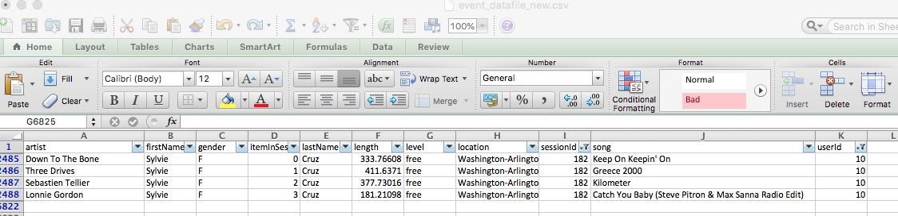
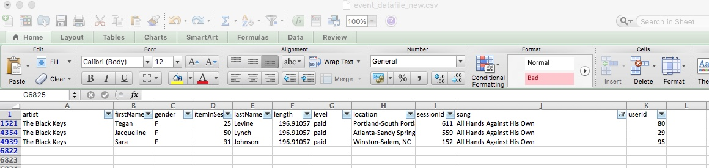

{
 "cells": [
  {
   "cell_type": "markdown",
   "metadata": {},
   "source": [
    "This project is to setup queries and associated tables in Apache Cassandra and run those queriest to extract data.  3 tables will be created:\n",
    "- song_info:table for query to give artist, song title and song's length in the music app history that was heard during sessionId = 338, and itemInSession = 4\n",
    "- artist_info:table for query to give only name of artist, song (sorted by itemInSession) and user (first and last name) for userid = 10, sessionid = 182\n",
    "- user_info:table to give every user name (first and last) in my music app history who listened to the song 'All Hands Against His Own'\n",
    "### Please note:  section to extract all data files is commented out due to issues at Udacity workspace - mentor advised download from dropbox.  One large datafile has been downloaded with 6821 rows.\n",
    "Files:\n",
    "- Project_1B_Project.ipynb - Main notebook file to create tables, queries, process and output.\n",
    "- event_datafile_new.csv - datafile with all data, 6821 rows.\n",
    "- 3 jpeg files - see below.\n",
    "Screen print of onfirmation by checking file in Excel below:\n",
    "\n",
    "\n",
    ""
   ]
  }
 ],
 "metadata": {
  "kernelspec": {
   "display_name": "Python 3",
   "language": "python",
   "name": "python3"
  },
  "language_info": {
   "codemirror_mode": {
    "name": "ipython",
    "version": 3
   },
   "file_extension": ".py",
   "mimetype": "text/x-python",
   "name": "python",
   "nbconvert_exporter": "python",
   "pygments_lexer": "ipython3",
   "version": "3.6.3"
  }
 },
 "nbformat": 4,
 "nbformat_minor": 2
}
